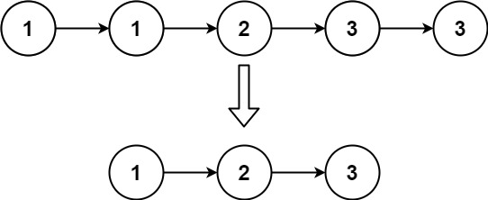

Given the head of a sorted linked list, delete all duplicates such that each element appears only once. Return the linked list sorted as well.

Example 1:

Input: head = [1,1,2]
Output: [1,2]

Example 2:

Input: head = [1,1,2,3,3]
Output: [1,2,3]